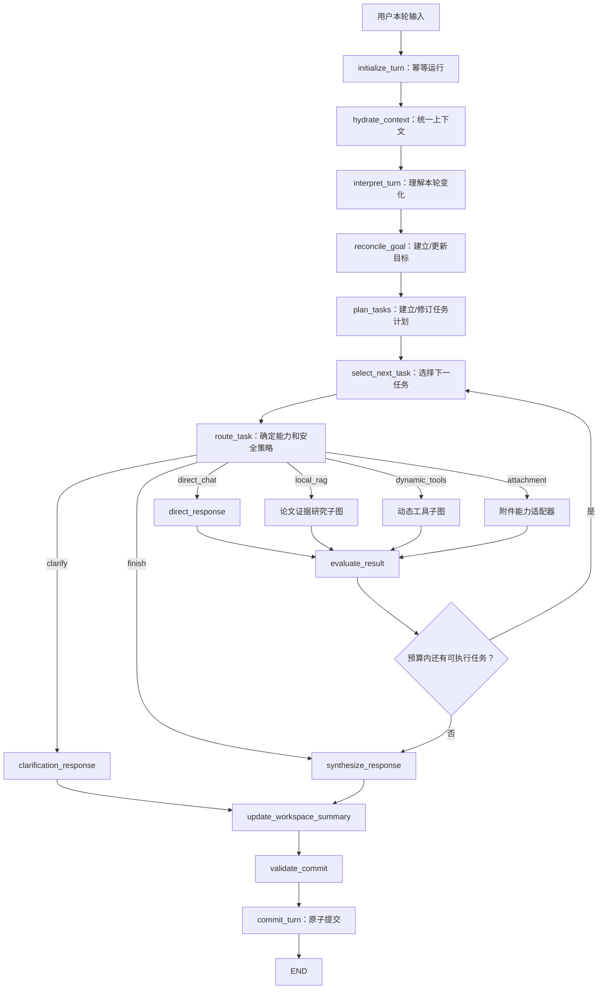

# 主 Agent 主体图架构与实施计划

> **For Codex:** REQUIRED SUB-SKILL: Use superpowers:executing-plans to implement this plan task-by-task.

> **For DeepSeek:** 必须逐任务、逐测试实施本计划。不得跳过失败测试，不得自行改名、合并状态层、把目标状态重新压成 `standalone_question`，也不得用 LangGraph checkpoint 代替业务会话状态。每完成一个 Task，运行该 Task 指定测试并提交一次中文 Git commit。

**Goal:** 在现有论文证据研究图和动态工具图之前新增一个跨轮次持久化的主 Agent 主体图，使每轮请求先恢复历史、目标、约束和任务计划，再选择子图执行，并在执行后原子提交新的会话状态。

**Architecture:** 保留 `paper_research_react_v2` 和 `paper_research_dynamic_tools_v1` 作为两个受控执行子图；新增 `agent/orchestrator` 主体层作为唯一认知与编排中心。主体层通过共享 `AgentContextEnvelope` 恢复固定最近历史、滚动摘要、活动目标、任务计划、远距会话召回和长期记忆，然后执行“解释本轮变化 → 对齐目标 → 规划任务 → 选择下一任务 → 路由子图 → 评估结果 → 综合回答 → 原子提交”的闭环。

**Tech Stack:** Python 3.11+、Pydantic v2、LangChain structured output、LangGraph 1.x、SQLite、`aiosqlite`、FastAPI、现有 Runtime、pytest/unittest、Ruff、Mypy。

---

## 0. 给 DeepSeek 的强制实施规则

1. 只实现本文定义的架构，不重新设计。
2. 先写测试并观察失败，再写最小实现。
3. 现有两个子图的证据、工具授权、审批和引用安全边界必须保留。
4. 主 Agent 状态必须使用严格 Pydantic 模型；禁止在图节点间长期传递无约束 JSON。
5. `conversation_id` 是业务会话主键；`run_id` 是一次主图运行；`request_id` 是客户端幂等键，三者不得混用。
6. LangGraph checkpoint 只用于运行恢复，不是会话记忆真相源。
7. 会话工作区真相源是 SQLite `conversation_workspaces`；消息真相源仍是 `conversation_turns`。
8. 两个子图只能读取主图传入的子任务并返回结果，不能直接修改主图目标和任务状态。
9. 任何模型输出必须先通过 Pydantic 校验和确定性策略门禁。
10. 历史助手回答、会话摘要和长期记忆都是 `non_evidence` 或 `research_context`，不能满足论文引用要求。
11. 第一版顺序执行多个能力，不做并行子图，避免现有共享 Runtime 的 `_busy` 冲突。
12. 不删除旧接口；先通过 feature flag 灰度切换。
13. 数据库变更必须向后兼容。
14. 不提交运行数据库、论文全文、向量索引、密钥和本地绝对路径。

---

## 1. 问题定义与设计原则

现有系统拥有两个执行子图：

- `paper_research_react_v2`：本地论文检索、证据获取、充分性评估和研究计划。
- `paper_research_dynamic_tools_v1`：动态工具选择、工具执行、长期记忆召回和人工审批恢复。

缺少跨轮次主 Agent 后，Web 只能把历史临时压缩成 `standalone_question` 再送入子图，导致：

1. 每轮根据当前一句重新猜目标。
2. 论文 Planner 的计划只属于单次检索，不是会话任务计划。
3. 历史决策、约束和未完成事项被降维成查询字符串。
4. 长期记忆只在动态子图内部召回，其他路径看不到同一份记忆。
5. 子图结果不更新“任务完成度和下一步”。
6. checkpoint 被误认为业务记忆。
7. conversation、RAG short-term、dynamic long-term 三套状态分裂。

唯一正确的数据流：

> 历史恢复为结构化状态 → 更新目标 → 更新任务计划 → 选择能力 → 调用子图 → 评估结果 → 原子提交新状态。

禁止：`当前消息 -> 路由 -> 子图内部临时找记忆`。

---

## 2. 总体架构



### 2.1 分层职责

| 层 | 负责 | 不负责 |
|---|---|---|
| Conversation Repository | 消息账本、工作区快照、幂等、版本 CAS、原子提交 | 语义理解 |
| Context Hydrator | 最近历史、摘要、目标、任务、远距候选、长期记忆和预算裁剪 | 规划、工具执行 |
| Main Agent Graph | 理解、目标、任务、路由、评估、综合回答 | 直接访问任意工具/论文正文 |
| Local RAG Child | 论文检索、证据规划、证据验证和引用回答 | 修改会话目标 |
| Dynamic Tool Child | 动态工具、外部研究、审批暂停恢复 | 修改主任务计划 |
| Web Projection | 认证、输入解析、附件 ID、安全事件投影 | 自行路由 |

Web 最终只能调用 `MainAgentRuntime.run/stream`，不能继续保留一套业务 `if route == ...` 编排。

---

## 3. 记忆与上下文分层

| 层 | 内容 | 每轮加载 | 真相源 | 信任 |
|---|---|---:|---|---|
| L0 | 当前消息、附件元数据、RAG 模式 | 是 | request | user_input |
| L1 | 最近 6 个完成轮次的原始用户消息和有限助手摘要 | 是 | conversation_turns | non_evidence |
| L2 | 滚动摘要、活动目标、任务计划、约束、未解决问题 | 是 | conversation_workspaces | non_evidence |
| L3 | 500 轮内相关旧轮次/Episode | 按预算 | conversation tables | non_evidence |
| L4 | 用户明确保存的偏好和背景 | 按目标召回 | long-term memory | research_context |

论文证据不是记忆。它只能由本轮 Local RAG 子图产生，信任类型为 `citation_evidence`。

### 3.1 每轮装载顺序

1. 加载 workspace 及 `version`。
2. 无条件加载最近 6 个完成轮次。
3. 用“当前消息 + 活动目标 + 未完成任务 + unresolved questions”召回远距会话。
4. 用同一稳定查询召回长期记忆。
5. 组装不可变 `AgentContextEnvelope`。
6. 才调用 Interpreter、Goal Reconciler 和 Task Planner。
7. 才允许路由子图。

### 3.2 上下文预算

| 区域 | 上限 |
|---|---:|
| 当前消息 | 10,000 字符 |
| 最近历史 | 12 条 message / 12,000 字符 |
| 滚动摘要 | 3,000 字符 |
| 活动目标与验收条件 | 3,000 字符 |
| 任务计划 | 6,000 字符 |
| 远距候选 | 5 个 / 6,000 字符 |
| 长期记忆 | 5 个 / 5,000 字符 |
| 附件元数据 | 2,000 字符 |

裁剪顺序：远距候选 → 最旧最近历史 → 低优先级长期记忆 → 已完成任务详情。当前消息、活动目标、未完成任务和安全策略不可裁剪。

---

## 4. 核心状态契约

创建 `src/paper_research_agent/agent/orchestrator/models.py`。所有模型使用 `ConfigDict(extra="forbid", frozen=True)`。

### 4.1 枚举

```python
GoalStatus = Literal["active", "satisfied", "blocked", "abandoned"]
TaskStatus = Literal[
    "pending", "ready", "running", "waiting_approval", "waiting_user",
    "completed", "failed", "skipped", "cancelled",
]
Capability = Literal[
    "direct_chat", "local_rag", "dynamic_tools", "attachment_qa", "file_edit",
]
RequestRelation = Literal[
    "new_goal", "continue_goal", "refine_goal", "answer_within_goal",
    "cancel_goal", "resume_after_approval", "meta_conversation",
]
RunStatus = Literal[
    "running", "waiting_user", "waiting_approval", "completed",
    "failed", "cancelled", "conflict",
]
```

### 4.2 领域模型

```python
class AcceptanceCriterion(FrozenModel):
    criterion_id: str = Field(pattern=r"^[A-Za-z0-9_-]{1,64}$")
    description: str = Field(min_length=1, max_length=500)
    satisfied: bool = False


class GoalState(FrozenModel):
    goal_id: str = Field(pattern=r"^[0-9a-f]{32}$")
    objective: str = Field(min_length=1, max_length=2_000)
    status: GoalStatus = "active"
    acceptance_criteria: tuple[AcceptanceCriterion, ...] = Field(default=(), max_length=12)
    constraints: tuple[str, ...] = Field(default=(), max_length=20)
    origin_turn_id: str = Field(pattern=r"^[0-9a-f]{32}$")
    created_at: datetime
    updated_at: datetime


class AgentTask(FrozenModel):
    task_id: str = Field(pattern=r"^[A-Za-z0-9_-]{1,64}$")
    goal_id: str = Field(pattern=r"^[0-9a-f]{32}$")
    title: str = Field(min_length=1, max_length=200)
    objective: str = Field(min_length=1, max_length=1_000)
    success_criteria: tuple[str, ...] = Field(min_length=1, max_length=8)
    capability: Capability
    status: TaskStatus = "pending"
    depends_on: tuple[str, ...] = Field(default=(), max_length=8)
    attempt_count: int = Field(default=0, ge=0, le=5)
    result_ref: str | None = Field(default=None, max_length=128)
    blocked_reason: str | None = Field(default=None, max_length=500)


class TaskPlan(FrozenModel):
    plan_id: str = Field(pattern=r"^[0-9a-f]{32}$")
    goal_id: str = Field(pattern=r"^[0-9a-f]{32}$")
    revision: int = Field(default=1, ge=1)
    tasks: tuple[AgentTask, ...] = Field(default=(), max_length=12)
    created_at: datetime
    updated_at: datetime
```

`TaskPlan` validator 必须拒绝：重复 task ID、未知依赖、自依赖、task.goal_id 不一致和依赖环。

```python
class ConversationWorkspace(FrozenModel):
    schema_version: Literal["conversation-workspace-v1"] = "conversation-workspace-v1"
    conversation_id: str = Field(min_length=1, max_length=256)
    version: int = Field(default=0, ge=0)
    summary: str = Field(default="", max_length=3_000)
    active_goal: GoalState | None = None
    task_plan: TaskPlan | None = None
    unresolved_questions: tuple[str, ...] = Field(default=(), max_length=10)
    stable_constraints: tuple[str, ...] = Field(default=(), max_length=20)
    updated_at: datetime


class ContextMessage(FrozenModel):
    turn_id: str
    sequence: int = Field(ge=1)
    role: Literal["user", "assistant"]
    content: str = Field(min_length=1, max_length=10_000)
    trust: Literal["non_evidence"] = "non_evidence"


class RecalledContext(FrozenModel):
    source_id: str
    kind: Literal["conversation_turn", "episode", "long_term_memory"]
    content: str = Field(min_length=1, max_length=3_000)
    relevance: float = Field(ge=0, le=1)
    trust: Literal["non_evidence", "research_context"]


class AgentContextEnvelope(FrozenModel):
    conversation_id: str
    request_id: str
    turn_id: str
    current_message: str
    rag_mode: Literal["disabled", "preferred", "required"]
    attachment_ids: tuple[str, ...] = ()
    workspace: ConversationWorkspace
    recent_messages: tuple[ContextMessage, ...] = ()
    recalled_context: tuple[RecalledContext, ...] = ()
    prepared_at: datetime
```

### 4.3 决策、子任务和结果

```python
class TurnInterpretationV2(FrozenModel):
    relation: RequestRelation
    resolved_request: str = Field(min_length=1, max_length=2_000)
    selected_context_ids: tuple[str, ...] = Field(default=(), max_length=10)
    goal_change_summary: str = Field(default="", max_length=1_000)
    new_constraints: tuple[str, ...] = Field(default=(), max_length=10)
    needs_clarification: bool = False
    clarification_question: str | None = Field(default=None, max_length=500)
    confidence: float = Field(ge=0, le=1)


class GoalDecision(FrozenModel):
    action: Literal["keep", "create", "revise", "satisfy", "block", "abandon"]
    goal: GoalState | None
    rationale: str = Field(min_length=1, max_length=500)


class TaskPlanDecision(FrozenModel):
    action: Literal["keep", "create", "revise", "clear"]
    plan: TaskPlan | None
    rationale: str = Field(min_length=1, max_length=500)


class ChildTaskRequest(FrozenModel):
    run_id: str
    conversation_id: str
    goal_id: str
    task_id: str
    objective: str
    success_criteria: tuple[str, ...]
    capability: Capability
    current_message: str
    conversation_summary: str
    constraints: tuple[str, ...]
    selected_context: tuple[RecalledContext, ...] = ()
    rag_mode: Literal["disabled", "preferred", "required"]
    attachment_ids: tuple[str, ...] = ()


class ChildTaskResult(FrozenModel):
    child_run_id: str
    task_id: str
    capability: Capability
    status: Literal[
        "completed", "insufficient_evidence", "waiting_approval", "failed"
    ]
    summary: str = Field(default="", max_length=5_000)
    source_ids: tuple[str, ...] = Field(default=(), max_length=100)
    citation_kind: Literal["none", "local_paper", "external"] = "none"
    pending_approval: dict[str, object] | None = None
    error_code: str | None = None
```

`MainAgentRequest` 必须含 request_id、conversation_id、message、rag_mode、attachment_ids。`MainAgentResult` 必须含 run_id、request_id、conversation_id、status、answer、route_trace、child_results、pending_approval、workspace_version。

### 4.4 LangGraph 临时状态

创建 `agent/orchestrator/state.py`，定义 `MainAgentGraphState(TypedDict, total=False)`，字段：

```text
run_id, request, base_workspace_version, context, interpretation,
goal_decision, plan_decision, workspace_draft, active_task_id, route,
child_results, direct_answer, final_answer, pending_approval,
remaining_child_calls, remaining_replans, termination_reason, next_action
```

TypedDict 只是图容器；每个节点入口和出口都必须用 Pydantic 模型验证。

---

## 5. 持久化与原子提交

扩展 `src/paper_research_agent/conversation/store.py`，在现有数据库增加：

```sql
CREATE TABLE IF NOT EXISTS conversation_workspaces (
    conversation_id TEXT PRIMARY KEY,
    schema_version TEXT NOT NULL,
    version INTEGER NOT NULL,
    state_json TEXT NOT NULL,
    updated_at TEXT NOT NULL
);

CREATE TABLE IF NOT EXISTS main_agent_runs (
    run_id TEXT PRIMARY KEY,
    request_id TEXT NOT NULL UNIQUE,
    conversation_id TEXT NOT NULL,
    turn_id TEXT NOT NULL,
    base_workspace_version INTEGER NOT NULL,
    committed_workspace_version INTEGER,
    status TEXT NOT NULL,
    result_json TEXT,
    created_at TEXT NOT NULL,
    updated_at TEXT NOT NULL,
    FOREIGN KEY(turn_id) REFERENCES conversation_turns(turn_id)
);
CREATE INDEX IF NOT EXISTS main_agent_runs_conversation_idx
    ON main_agent_runs(conversation_id, created_at DESC);
```

### 5.1 Repository 接口

```python
def begin_agent_run(
    self, *, request_id: str, conversation_id: str, user_question: str
) -> AgentRunStart: ...

def load_workspace(self, conversation_id: str) -> ConversationWorkspace: ...

def load_agent_run(self, request_id: str) -> MainAgentResult | None: ...

def commit_agent_run(
    self, *, run_id: str, turn_id: str, expected_workspace_version: int,
    workspace: ConversationWorkspace, route: str, status: ConversationStatus,
    resolution: ConversationResolution, assistant_summary: str | None,
    source_ids: Sequence[str], result: MainAgentResult,
) -> CommitOutcome: ...
```

`begin_agent_run` 在一个 `BEGIN IMMEDIATE` 中：查 request ID；重复完成则返回缓存，重复运行则返回相同 run；不存在才创建 pending turn、初始化 workspace、插入 run。

`commit_agent_run` 在一个 `BEGIN IMMEDIATE` 中：校验 run 状态；CAS 校验 workspace version；完成 turn；写入 version+1 workspace；写 result；一次 commit。任一步失败全部 rollback。禁止先完成 turn 再单独写 workspace。

### 5.2 并发规则

- Runtime 按 conversation ID 使用独立 `asyncio.Lock`；不同会话可并发。
- SQLite 使用 WAL 和 busy timeout。
- 跨进程依靠 workspace version CAS。
- CAS 冲突不覆盖，重新 hydrate 后最多重试一次。
- 等待审批期间不持有锁或事务。
- 清空会话同时删除 turns、episodes、workspace、runs 和三类 checkpoint。

---

## 6. 主图节点规范

### 6.1 initialize_turn

验证请求；调用 `begin_agent_run`；初始化 child_calls=3、replans=1；重复完成请求直接 `return_cached`。禁止调用模型和子图。

### 6.2 hydrate_context

创建 `orchestrator/hydrator.py`。无条件加载最近历史；召回查询必须包含当前消息、活动目标、未完成任务和 unresolved questions；读取长期记忆；组装 envelope。长期记忆失败降级为空，不终止主图。

### 6.3 interpret_turn

创建 `orchestrator/interpreter.py`。只输出本轮与目标的关系，不选择工具、不回答。区分新目标、继续、修订、目标内问答、取消、审批恢复和元对话。模型只能引用输入 context ID。置信度低于 0.55 且会改变目标时必须澄清。

### 6.4 reconcile_goal

确定性规则优先：

1. cancel：旧目标 abandoned，未完成任务 cancelled。
2. continue：复用 goal_id。
3. answer_within_goal：保留目标和计划。
4. refine：保留 goal_id，更新 objective/criteria/constraints。
5. new：旧 active 目标 abandoned，创建新 goal_id。
6. 无目标且非 meta：创建目标。
7. 禁止每轮创建 goal_id。

### 6.5 plan_tasks

这是会话级任务计划，不是论文检索计划。每个 task 只有一个 capability，最多 12 个，有明确 success criteria，ID 在 revision 间稳定，completed 不回退。混合研究必须拆为 local_rag 与 dynamic_tools 两个任务。仅在新目标、目标修订、可恢复失败或结果暴露新缺口时 revision+1。

### 6.6 select_next_task

纯确定性：优先恢复 waiting_approval；然后选择所有依赖 completed 的 ready/pending；没有可执行任务但有 waiting_user 则澄清；全部终态则综合；依赖 failed 则 blocked。同一时刻最多一个 running。

### 6.7 route_task

Router 输入 AgentTask + Envelope，不是当前一句。策略优先级：

1. 附件读取/总结 → attachment_qa。
2. 明确修改附件并产出文件 → file_edit。
3. rag_mode required：研究任务只能 local，禁止外部动态研究。
4. rag_mode disabled：禁止 local。
5. 需要论文证据 → local_rag。
6. 需要最新信息/联网/非论文工具 → dynamic_tools。
7. 不需外部事实 → direct_chat。
8. 单任务不能同时两种 capability；混合需求拆任务。
9. 写入审批仍由动态子图门禁。

### 6.8 dispatch_local_rag

将 `ChildTaskRequest.objective` 作为研究问题；conversation context 投影必须包含目标、相关历史和约束；论文子图只做证据检索子计划；投影为 `ChildTaskResult(citation_kind="local_paper")`。证据不足默认不算任务成功。

### 6.9 dispatch_dynamic_tools

修改 dynamic graph/router/runtime，使其接受显式 child request 和 memory_context。主图已提供 memory 时跳过内部召回。Router 看到 goal、task、criteria、constraints 和 observations。waiting approval 时主任务同步 waiting_approval。恢复时只恢复原 task_id，不重做 interpret/goal/plan。

### 6.10 direct_response

新增 `ConversationRuntime.stream_contextual_chat(DirectResponseRequest)`。显式接收最近历史、摘要、目标、当前任务、召回上下文和当前消息；不得自行二次读取 store，避免版本不一致和重复消息。

### 6.11 evaluate_result

创建 `orchestrator/evaluator.py`，输出 `TaskEvaluation`：task_id、outcome(complete/retry/replan/wait_user/fail)、satisfied/missing criteria、summary、reason。Local 引用充分性使用子图可信字段；外部结果不能标为本地引用；记忆不能满足证据条件。每任务最多两次，整轮最多三次 child call、一次 replan。

### 6.12 synthesize_response

直接回应本轮；必要时自然说明进度；本地论文引用和外部来源分开；waiting approval 只返回审批说明；waiting user 只问一个最关键问题；不得机械暴露内部完整计划。

### 6.13 update_workspace_summary

滚动摘要只记录目标、稳定约束、决策、完成任务结果边界和未完成事项。禁止写完整证据、临时 citation ID、工具原始输出、provider 响应和 system prompt。

### 6.14 validate_commit

校验 version+1、goal/plan ID 一致、最多一个 running、终态无 running、审批状态一致、route trace 与 child results 对应、source IDs 去重、非 cancelled 结果回答非空。

### 6.15 commit_turn

唯一可写 workspace 的图节点，调用 repository 原子 CAS 提交。

---

## 7. 路由边与审批恢复

```text
START -> initialize -> hydrate -> interpret -> reconcile_goal -> plan_tasks
      -> select_next_task -> route_task

route_task -> direct_response | local_rag | dynamic_tools
           | attachment_qa | file_edit | clarify | synthesize

dispatch/direct -> evaluate -> update_task_state
                -> select_next_task | plan_tasks | synthesize | pause_approval

clarify/pause/synthesize -> update_summary -> validate -> commit -> END
```

审批协议：

1. 动态子图返回 waiting_approval。
2. 主任务更新 waiting_approval，保存 pending payload。
3. 原子提交 workspace 和 run waiting_approval，结束请求。
4. 审批 API 使用原 request_id 或 run_id，不能靠新消息猜恢复对象。
5. resume 加载 checkpoint 和 workspace，校验 task_id/hash/过期时间。
6. 只调用 resume_dynamic_tools，不重跑 interpret、goal、plan。
7. 恢复后进入 evaluate → synthesize → commit。
8. 拒绝/过期是合法终态，且副作用不得发生。

Checkpoint 命名必须隔离每次运行：

```text
main::<conversation_id>::<run_id>
research::<conversation_id>::<run_id>::<task_id>
dynamic::<conversation_id>::<run_id>::<task_id>
```

禁止所有轮次共享单一 conversation thread checkpoint。

---

## 8. Prompt 契约

创建 `orchestrator/prompts.py`，版本化常量：

```python
TURN_INTERPRETER_PROMPT_VERSION = "main-turn-interpreter-v1"
GOAL_RECONCILER_PROMPT_VERSION = "main-goal-reconciler-v1"
TASK_PLANNER_PROMPT_VERSION = "main-task-planner-v1"
TASK_EVALUATOR_PROMPT_VERSION = "main-task-evaluator-v1"
WORKSPACE_SUMMARIZER_PROMPT_VERSION = "main-workspace-summary-v1"
```

Interpreter 核心：只判断当前消息与目标关系，不路由、不回答；相关追问不替换目标；只有明确不同成果才 new_goal；低信任历史不是证据。

Goal 核心：目标描述用户成果，不描述模型动作；continue/refine 复用 ID；验收条件必须可判断。

Task Planner 核心：规划会话任务，不规划论文关键词；每任务一种能力；混合研究拆任务；保留 completed 和 task ID；不超过 12。

Evaluator 核心：只依据 child result 和 criteria；不创造引用和来源；历史/摘要/记忆不能证明证据型条件。

所有 structured output：temperature=0、关闭 thinking、最多重试一次，第二次失败执行确定性降级。

---

## 9. 故障、预算与可观测性

```python
MAX_CHILD_CALLS_PER_RUN = 3
MAX_REPLANS_PER_RUN = 1
MAX_TASK_ATTEMPTS = 2
MAX_PLAN_TASKS = 12
MAX_RECENT_TURNS = 6
MAX_RECALLED_TURNS = 5
MAX_LONG_TERM_MEMORIES = 5
MAIN_RUN_TIMEOUT_SECONDS = 180
```

| 故障 | 行为 |
|---|---|
| Interpreter 两次无效 | 保留旧目标；改变目标不明则澄清 |
| Goal 模型无效 | 确定性 keep/create/cancel |
| Planner 无效 | 创建一个 resolved request 单任务 |
| Local RAG 不可用 | required 报错；preferred 标记能力不可用 |
| Dynamic 不可用 | 不伪装联网成功 |
| 记忆召回失败 | 空集合继续，记录 degraded |
| CAS 冲突 | 重新 hydrate，最多重试一次 |
| 主图超时 | failed，不能留下 running task |
| 客户端断流 | 完成 commit 或明确 cancelled |
| 重复 request | 返回缓存，不重复副作用 |

复用 AgentEvent，增加 main_run_started、context_hydrated、turn_interpreted、goal_reconciled、task_plan_updated、task_dispatched、task_evaluated、main_run_paused、workspace_commit_conflict、main_run_completed/failed。日志只存 ID、状态、耗时、数量和 hash，不存正文。

---

## 10. Web 接口与 Feature Flag

修改 `web/app.py`、`web/models.py`、`web/chat_runtime.py`、`web/runtime.py`。QuestionRequest 增加可选 request_id；无值时服务端生成并返回。浏览器重试必须复用。

统一 NDJSON 示例：

```json
{"type":"run_started","request_id":"...","run_id":"..."}
{"type":"context_ready","recent_turns":6,"recalled_items":3,"workspace_version":4}
{"type":"goal","action":"keep","goal_id":"..."}
{"type":"plan","revision":2,"active_task_id":"collect-local-evidence"}
{"type":"route","capability":"local_rag","reason":"任务需要本地论文证据"}
{"type":"child_result","task_id":"...","status":"completed"}
{"type":"delta","text":"..."}
{"type":"approval_required","payload":{}}
{"type":"done","status":"completed","workspace_version":5}
```

公开事件不含完整 workspace、历史文本、长期记忆正文或内部 success criteria。

增加 `PRA_MAIN_AGENT_ENABLED=false`：false 保持旧路径；true 所有聊天研究入口进入 MainAgentRuntime。真实多轮验收后才改默认。

---

## 11. 文件布局

新建：

```text
src/paper_research_agent/agent/orchestrator/
  __init__.py models.py state.py prompts.py hydrator.py interpreter.py
  planner.py router.py children.py evaluator.py graph.py runtime.py factory.py

tests/agent/orchestrator/
  __init__.py helpers.py test_models.py test_repository.py test_hydrator.py
  test_interpreter.py test_planner.py test_router.py test_children.py
  test_evaluator.py test_graph.py test_runtime.py test_approval_resume.py
  test_concurrency.py
```

修改：

```text
src/paper_research_agent/conversation/store.py
src/paper_research_agent/conversation/models.py
src/paper_research_agent/agent/factory.py
src/paper_research_agent/agent/runtime.py
src/paper_research_agent/agent/dynamic/{graph,router,runtime}.py
src/paper_research_agent/web/{app,models,chat_runtime,runtime}.py
scripts/serve_web.py
docs/系统架构.md
README.md
.env.example
```


---

## 12. 分阶段实施任务

必须顺序执行，每个 Task 单独提交。统一命令使用项目虚拟环境：

```powershell
.\.venv\Scripts\python.exe -m pytest <tests> -q
.\.venv\Scripts\ruff.exe check <files>
.\.venv\Scripts\mypy.exe src/paper_research_agent
git diff --check
```

### Task 1: 主 Agent 严格状态契约

**Files:**

- Create: `src/paper_research_agent/agent/orchestrator/__init__.py`
- Create: `src/paper_research_agent/agent/orchestrator/models.py`
- Create: `src/paper_research_agent/agent/orchestrator/state.py`
- Test: `tests/agent/orchestrator/test_models.py`

**Steps:**

1. 写失败测试：goal/plan ID 一致、重复 task、未知/自/循环依赖、状态枚举、审批一致性。
2. 运行测试，预期 FAIL：模块不存在。
3. 实现第 4 节模型和 validator，不用裸 dict 替代领域字段。
4. 运行测试，预期 PASS。
5. 运行 Ruff 和 `git diff --check`。
6. Commit：`功能: 建立主Agent状态契约`。

### Task 2: 会话工作区和幂等运行存储

**Files:**

- Modify: `src/paper_research_agent/conversation/store.py`
- Test: `tests/agent/orchestrator/test_repository.py`
- Test: `tests/conversation/test_store.py`

**Steps:**

1. 写失败测试：新 workspace version=0；相同 request 只创建一个 turn；完成请求返回缓存；clear 删除 workspace/runs。
2. 运行两组测试并确认缺少接口。
3. 实现新表、Protocol、SQLite 和 InMemory 的 begin/load。
4. 回归原 ConversationStore 测试。
5. Commit：`功能: 增加会话工作区与幂等运行存储`。

### Task 3: 原子 CAS 提交

**Files:**

- Modify: `src/paper_research_agent/conversation/store.py`
- Test: `tests/agent/orchestrator/test_repository.py`

**Steps:**

1. 写失败测试：turn 与 workspace 同事务、version+1、旧版本冲突、注入异常完整 rollback、重复 commit 幂等。
2. 实现 `commit_agent_run`，只用一个 `BEGIN IMMEDIATE`。
3. 禁止调用旧 `complete_turn` 后另开事务写 workspace。
4. 运行测试和 SQLite 并发回归。
5. Commit：`功能: 实现主Agent会话状态原子提交`。

### Task 4: Context Hydrator

**Files:**

- Create: `src/paper_research_agent/agent/orchestrator/hydrator.py`
- Test: `tests/agent/orchestrator/test_hydrator.py`

**失败测试必须覆盖：**

- 当前句没有指代词也始终带最近 6 轮。
- 远距召回查询含 active goal、未完成任务和 unresolved questions。
- 长期记忆在任何子图路由前读取。
- 5/20/100 轮远距恢复。
- conversation 隔离。
- 预算裁剪顺序。
- 所有旧助手内容为 non_evidence。
- 召回失败安全降级。

完成后 Commit：`功能: 建立主Agent统一上下文装载器`。

### Task 5: 本轮关系解释器

**Files:**

- Create: `src/paper_research_agent/agent/orchestrator/prompts.py`
- Create: `src/paper_research_agent/agent/orchestrator/interpreter.py`
- Test: `tests/agent/orchestrator/test_interpreter.py`

使用 fake structured model 测试 new/continue/refine/within/cancel/resume/meta、未知 context ID、低置信度目标切换澄清和一次重试。解释器严禁输出 route/capability。旧 TurnInterpretation 保留兼容。

Commit：`功能: 增加主Agent轮次关系解释器`。

### Task 6: 目标对齐器

**Files:**

- Create: `src/paper_research_agent/agent/orchestrator/planner.py`
- Test: `tests/agent/orchestrator/test_planner.py`

测试继续和修订复用 goal_id、新目标换 ID、取消、目标内问答不替换、元对话不建伪目标、无目标时创建。先做确定性规则，再允许模型补全 objective/criteria。

Commit：`功能: 实现跨轮次目标对齐`。

### Task 7: 会话级 Task Planner

**Files:**

- Modify: `src/paper_research_agent/agent/orchestrator/planner.py`
- Test: `tests/agent/orchestrator/test_planner.py`

测试单问单任务、混合研究拆任务、task ID 稳定、completed 不回退、依赖无环、最多 12、revision 触发和 fallback 单任务。禁止复用论文 `ResearchPlan`。

Commit：`功能: 建立会话级任务规划器`。

### Task 8: 任务选择和策略路由

**Files:**

- Create: `src/paper_research_agent/agent/orchestrator/router.py`
- Test: `tests/agent/orchestrator/test_router.py`

测试 waiting approval 优先、依赖选择、required/disabled、附件读取/修改、论文证据、最新外部信息、普通对话和混合任务拆分。实现为纯函数，不调用模型/子图/数据库。

Commit：`功能: 增加主Agent任务选择与策略路由`。

### Task 9: 子图统一适配器

**Files:**

- Create: `src/paper_research_agent/agent/orchestrator/children.py`
- Modify: `src/paper_research_agent/agent/runtime.py`
- Modify: `src/paper_research_agent/web/runtime.py`
- Test: `tests/agent/orchestrator/test_children.py`
- Regression: `tests/agent/test_runtime.py`, `tests/web/test_runtime.py`

验证 local 输入使用 task objective；dynamic 输入含 goal/criteria/constraints；两种输出投影统一；local/external citation_kind 不混淆。不得放松子图安全校验。

Commit：`功能: 统一主Agent子图调用契约`。

### Task 10: 长期记忆召回上移

**Files:**

- Modify: `src/paper_research_agent/agent/dynamic/graph.py`
- Modify: `src/paper_research_agent/agent/dynamic/router.py`
- Modify: `src/paper_research_agent/agent/dynamic/runtime.py`
- Test: `tests/agent/orchestrator/test_children.py`
- Regression: dynamic graph/router/runtime tests

提供 memory_context 时不得内部搜索；未提供时保留旧接口 fallback。主图路径必须显式传入。验证论文与动态图消费同一 envelope 投影。

Commit：`重构: 将长期记忆召回上移至主Agent`。

### Task 11: 结果评估和 Workspace Reducer

**Files:**

- Create: `src/paper_research_agent/agent/orchestrator/evaluator.py`
- Test: `tests/agent/orchestrator/test_evaluator.py`

测试 complete/retry/replan/wait/fail、证据不足、外部来源不算本地论文、attempt/replan budget、终态清除 running。Reducer 必须是纯函数：`old workspace + decision/result -> new workspace`。

Commit：`功能: 增加主Agent任务结果评估`。

### Task 12: 构建主 LangGraph

**Files:**

- Create: `src/paper_research_agent/agent/orchestrator/graph.py`
- Test: `tests/agent/orchestrator/test_graph.py`

用 fake nodes 覆盖 direct、local、dynamic、hybrid 顺序、clarify、replan、approval pause、预算耗尽、finish、cached。严格按第 6/7 节建边。除 commit node 外禁止节点写 SQL。

Commit：`功能: 构建主Agent主体图`。

### Task 13: MainAgentRuntime 与审批恢复

**Files:**

- Create: `src/paper_research_agent/agent/orchestrator/runtime.py`
- Create: `src/paper_research_agent/agent/orchestrator/factory.py`
- Modify: `src/paper_research_agent/agent/factory.py`
- Test: `tests/agent/orchestrator/test_runtime.py`
- Test: `tests/agent/orchestrator/test_approval_resume.py`

测试每会话锁、不同会话并发、超时、checkpoint 唯一、审批不重规划、拒绝/过期、clear 删除 main/research/dynamic checkpoint。模型和连接由 factory 完整关闭。

Commit：`功能: 增加主Agent运行时与审批恢复`。

### Task 14: 普通聊天进入共享上下文

**Files:**

- Modify: `src/paper_research_agent/web/chat_runtime.py`
- Test: `tests/web/test_chat_runtime.py`
- Test: `tests/agent/orchestrator/test_children.py`

新增 `stream_contextual_chat`，测试其使用显式 envelope、不二次读 store、不重复当前消息、能看到 active goal/pending task。保留旧 stream_chat 兼容。

Commit：`功能: 将普通对话接入主Agent上下文`。

### Task 15: Web 主入口与 feature flag

**Files:**

- Modify: `src/paper_research_agent/web/app.py`
- Modify: `src/paper_research_agent/web/models.py`
- Modify: `scripts/serve_web.py`
- Test: `tests/web/test_conversation_integration.py`
- Test: `tests/web/test_app.py`
- Test: `tests/web/test_static.py`

测试 flag 开/关、request ID、统一事件、旧路径兼容，以及 flag=true 时 Web 不再执行业务 route 分支。Web 只做认证、解析、附件验证、安全投影和流输出。

Commit：`功能: 接入Web主Agent统一入口`。

### Task 16: 并发、幂等和断流

**Files:**

- Create: `tests/agent/orchestrator/test_concurrency.py`
- Modify: `tests/web/test_conversation_integration.py`

测试相同 request 并发、同会话双请求 CAS、不同会话并行、客户端断流、工具副作用不重复。不得用全局串行锁掩盖问题。

Commit：`测试: 增加主Agent并发与幂等门禁`。

### Task 17: 多轮金标评测

**Files:**

- Create: `evaluation/datasets/main-agent-conversation-v1.jsonl`
- Create: `src/paper_research_agent/evaluation/main_agent.py`
- Create: `tests/evaluation/test_main_agent.py`

数据记录 turns、预期 relation、goal continuity、plan revision、capabilities 和 final status。评分至少包括 goal continuity、plan continuity、route correctness、memory-before-routing、duplicate-side-effect。

Commit：`评测: 建立主Agent多轮上下文金标`。

### Task 18: 文档和发布门禁

**Files:**

- Modify: `docs/系统架构.md`
- Modify: `README.md`
- Modify: `.env.example`

运行：

```powershell
.\.venv\Scripts\python.exe -m pytest tests/agent/orchestrator tests/conversation tests/web -q
.\.venv\Scripts\python.exe -m pytest -q
.\.venv\Scripts\ruff.exe check src tests scripts
.\.venv\Scripts\mypy.exe src/paper_research_agent
git diff --check
```

全部退出码必须为 0。随后本地启用 flag 做真实多轮验收；报告不得记录完整 prompt/response。

Commit：`文档: 完成主Agent架构与发布门禁`。

---

## 13. 必须通过的端到端场景

### A. 目标连续性

```text
帮我比较 RAG 和 GraphRAG，最后给出选型建议。
先从评测指标开始。
继续。
```

三轮同一 goal_id；第二轮不建新目标；第三轮执行计划下一步，而非只把“继续”改写为查询。

### B. 普通聊天转论文研究

```text
我在做大模型测评框架。
希望最终得到适合内部模型的指标体系。
现在结合本地论文找依据。
```

前两轮建立目标/约束；第三轮 Local RAG objective 包含完整目标；论文图看到与普通聊天相同 workspace。

### C. 混合研究

“比较论文中的方法，并核验这些项目 2026 年的最新维护状态。”

一个 goal，至少 local_rag 后 dynamic_tools 两个任务，顺序执行，最终分开论文证据和外部最新资料。

### D. 目标修订

```text
比较 A、B、C。
不要 C，加入 D，只看推理成本和准确率。
```

goal_id 不变，plan revision+1，已完成且仍有效的 A/B 任务不回退。

### E. 新目标切换

```text
先完成论文比较。
这件事先放下，帮我修改上传的简历。
```

旧目标 abandoned，新 goal_id，走 file_edit，旧论文上下文不泄漏到附件修改。

### F. 审批恢复

保存报告 → 等待审批 → 批准。恢复原 task_id，不重做 interpret/goal/plan，副作用恰好一次。

### G. 重复请求

同 request ID 因网络重试发送两次。只创建一个 turn，只执行一次子图/写操作，第二次返回缓存或当前状态。

### H. 证据边界

长期记忆声称“论文 X 准确率 99%”，本轮论文检索无此证据。不得作为论文事实或本地引用。

### I. 清空会话

清空后说“继续”。不得看到旧 goal/plan/turn/checkpoint，应请求明确新目标。

### J. 100 轮后恢复

明确“回到之前的 RAG 选型任务”。唯一候选则恢复对应 goal/plan；多个相近候选则澄清。

### K. 目标内临时问题

活动目标进行中，用户问“你为什么把成本作为维度？”回答问题但不替换 goal，不清空计划。

### L. 子图失败

Local RAG timeout 后 workspace 不得停留 running；required 模式明确失败，preferred 模式可说明能力不可用但不能伪造证据。

---

## 14. 验收指标

| 指标 | 门槛 |
|---|---:|
| 明确继续场景 goal_id 保持率 | 100% |
| 明确新目标正确切换率 | 100% |
| 已完成任务不回退率 | 100% |
| required 外部工具违规率 | 0% |
| disabled 本地检索违规率 | 0% |
| 历史/记忆冒充论文证据 | 0% |
| 重复 request 副作用重复率 | 0% |
| 审批恢复重新规划率 | 0% |
| 跨 conversation 污染率 | 0% |
| workspace/turn 提交撕裂率 | 0% |

真实模型额外观察：相关追问是否误换目标、复杂任务是否过拆、普通单问是否过度 Agent 化、回答是否自然而非机械展示状态机。

---

## 15. 明确不做

第一版不做：多 Agent 并行、子图并行、自动长期记忆写入、多用户共享目标、任意代码执行、完整历史全塞 prompt、用向量库替代业务状态、每句话建目标、合并 Main TaskPlan 与 ResearchPlan、立即删除旧 short-term memory 兼容代码。

---

## 16. Definition of Done

1. 主图在两个子图前 hydrate 统一上下文。
2. 目标和任务计划跨轮次持久化。
3. 普通聊天、本地论文、动态工具、附件都由主图路由。
4. 两个子图不再只依赖当前一句。
5. 长期记忆在上游召回且主路径不重复召回。
6. 子图结果更新 task status 和 plan revision。
7. 审批恢复不重新规划。
8. request 幂等和 workspace CAS 生效。
9. turn 与 workspace 原子提交。
10. clear 删除全部业务状态和 checkpoint。
11. 第 13 节全部有自动测试。
12. pytest、Ruff、Mypy、diff check 全通过。
13. flag=false 保持兼容。
14. flag=true 真实多轮验收通过。

---

## 17. 交给 DeepSeek 的固定执行指令

```text
你是本计划的代码执行者，不是架构设计者。
只实施当前指定 Task，不提前做后续 Task，不重构无关文件。
开始前读取 AGENTS.md、本文、当前 Task 涉及的源文件和测试。
先写要求的失败测试并实际运行，报告准确失败原因。
然后写使测试通过的最小实现，运行聚焦测试、相关回归和 git diff --check。
不要用 standalone_question 代替 GoalState 或 TaskPlan。
不要用 LangGraph checkpoint 代替 conversation_workspaces。
不要让子图修改主工作区。
不要放松 Pydantic、引用、工具授权、审批或数据安全校验来通过测试。
如果现有代码与本文冲突，停止并列出冲突，不自行改变架构。
完成后列出修改文件、测试命令与结果、剩余风险、建议 commit message。
```
