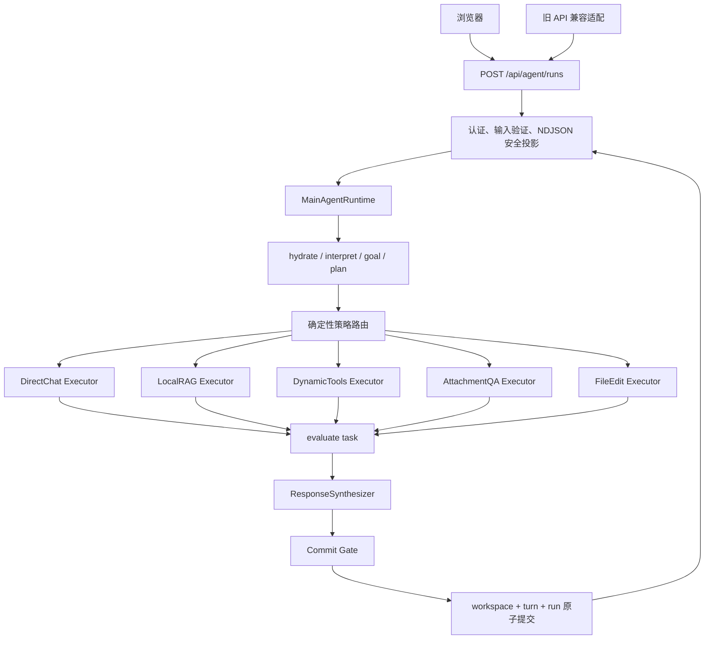

# 主 Agent 统一生产入口与总体接口路由 Implementation Plan

> **For Codex:** REQUIRED SUB-SKILL: Use superpowers:executing-plans to implement this plan task-by-task.

**Goal:** 让主 Agent 成为 Web 的唯一业务编排入口，补齐普通聊天、附件、文件编辑、结果综合、提交门禁和审批恢复，并把旧接口收敛为可回滚的兼容适配层。

**Architecture:** 新增一个生产 `ApplicationServices` 装配边界，共享 Conversation Store、RAG Runtime、Chat Runtime、Attachment Store 和 MainAgentRuntime；浏览器只调用统一的 `POST /paper-research/api/agent/runs` NDJSON 接口。主图负责上下文、目标、计划、能力路由和任务状态，所有能力由类型化 Child Executor 执行；Web 不再包含 `if route == ...` 的业务编排。旧 `/ask`、`/chat/stream`、`/tools/run` 和 `/tools/approval` 在迁移期仅做协议转换，并可通过 `PRA_MAIN_AGENT_MODE=legacy|primary` 一键回滚。

**Tech Stack:** Python 3.11+、FastAPI、Pydantic v2、LangGraph 1.x、LangChain structured output、SQLite/aiosqlite、Vanilla JavaScript、NDJSON、unittest/pytest、Ruff、Mypy。

---

## 0. 当前事实与本计划边界

当前代码已经具备 `paper_research_main_v1`、固定论文研究图、动态工具图、Conversation Store 和主图领域模型，但默认 `scripts/serve_web.py -> create_app()` 不构造 `MainAgentRuntime`。即使外部注入主 Runtime，仍存在以下缺口：

1. `direct_response` 原样回显用户输入，没有调用普通聊天模型。
2. `attachment_qa` 和 `file_edit` 被 Router 选中后没有对应主图分支，最终退化为 direct response。
3. `synthesize_response` 仅拼接子任务摘要，不按目标、验收条件和来源综合回答。
4. `validate_commit` 生成错误列表后仍无条件执行 `commit_turn`。
5. `MainAgentRuntime.resume_approval` 依赖外部回调，默认生产启动没有实现。
6. 主图 NDJSON 只有 `run_started/delta/done`，丢失路由、子任务、RAG、附件和审批的安全投影。
7. 浏览器每次请求不生成并复用 `request_id`，断线重试不能利用已有幂等存储。
8. Web 的 `/chat/stream` 仍承担 Conversation 解释、能力规划、子 Runtime 调用和完成 turn 的职责，形成第二套业务编排器。

本计划不重写已稳定的论文检索、证据编译、引用验证、动态工具 Schema 或审批令牌；只改它们的上游装配和统一调用契约。

## 1. 目标调用链



核心约束：

- Web 只负责协议、安全投影和生命周期，不选择业务能力。
- 每个任务只对应一种 capability；混合研究由主图顺序执行多个任务。
- 子执行器不得写 `ConversationWorkspace`。
- Local RAG 返回的引用元数据必须原样通过类型化产物传到统一输出，不能压成一段 summary 后丢失。
- 历史、目标、摘要和长期记忆仍是非证据；只有本轮固定证据图产生的来源可以作为本地论文引用。
- 等待审批时先提交业务状态，再结束请求；恢复时只恢复原 task，不重新 interpret/goal/plan。

## 2. 总体接口设计

### 2.1 唯一主运行接口

```http
POST /paper-research/api/agent/runs
Content-Type: application/json
Accept: application/x-ndjson
```

请求：

```json
{
  "request_id": "32-or-64-char-client-id",
  "message": "比较 C001 和 C002，并核验最新发表状态",
  "rag_mode": "preferred",
  "attachment_ids": []
}
```

规则：

- `request_id` 在新接口中必填；浏览器在提交前生成并持久化，网络重试必须复用。
- `rag_mode=disabled` 禁止 Local RAG；`preferred` 允许组合；`required` 禁止外部动态研究。
- 同一 `request_id` 已完成时返回缓存事件；正在执行时返回 `run_reused`，不得重复副作用。
- HTTP 只表达认证、请求格式和服务可用性；运行中的业务失败通过 NDJSON `error/done` 事件表达。

### 2.2 审批恢复接口

```http
POST /paper-research/api/agent/runs/{request_id}/approval
Content-Type: application/json
Accept: application/x-ndjson

{"approved": true}
```

该接口按 `request_id -> run_id -> task_id -> child checkpoint` 恢复，禁止只按 conversation 恢复“最近一个”动态任务。

### 2.3 运行状态接口

```http
GET /paper-research/api/agent/runs/{request_id}
```

仅返回安全状态投影：`running/waiting_user/waiting_approval/completed/failed/conflict`、run ID、workspace version、等待审批摘要和已完成答案；不返回内部计划全文、长期记忆正文、证据正文或 checkpoint。

### 2.4 统一事件契约

每行事件都必须包含：

```json
{
  "schema_version": "main-agent-stream-v1",
  "event_id": 1,
  "type": "run_started",
  "request_id": "...",
  "run_id": "..."
}
```

允许的 `type`：

```text
run_started, run_reused, context_ready, goal_updated, plan_updated,
task_started, route_selected, rag_result, tool_result, attachment_result,
file_result, task_completed, approval_required, delta, error, done
```

必须保持单调 `event_id`；`done` 恰好一次。公开事件不得含问题正文、内部 prompt、证据正文、工具完整参数、审批令牌、绝对路径或 Provider 原始响应。

### 2.5 旧接口迁移

| 旧接口 | `legacy` 模式 | `primary` 模式 |
|---|---|---|
| `POST /ask` | 保持原实现 | 转换成统一 run，收集终态并返回旧 `AskResponse`；无法无损投影时返回 409，不伪造 |
| `POST /chat/stream` | 保持原实现 | 转发统一 NDJSON 流，保留旧事件别名一个发布周期 |
| `POST /tools/run` | 保持原实现 | 创建 `rag_mode=disabled` 的统一 run |
| `POST /tools/approval` | 保持原实现 | 要求 `request_id`，转发新审批接口 |

新浏览器只调用新接口；旧接口不再被前端使用。确认生产日志无旧客户端后，另开计划删除兼容层。

## 3. 新增和调整的严格契约

在 `web/models.py` 增加：

```python
class AgentRunRequest(WebModel):
    request_id: str = Field(pattern=r"^[A-Za-z0-9_-]{16,128}$")
    message: str = Field(min_length=1, max_length=10_000)
    rag_mode: RAGMode = "disabled"
    attachment_ids: tuple[str, ...] = Field(default=(), max_length=5)


class AgentApprovalRequest(WebModel):
    approved: bool


class AgentRunStatusResponse(WebModel):
    request_id: str
    run_id: str
    status: Literal[
        "running", "waiting_user", "waiting_approval", "completed",
        "failed", "cancelled", "conflict",
    ]
    answer: str = ""
    workspace_version: int = Field(ge=0)
    pending_approval: SafePendingToolApproval | None = None
```

在 `agent/orchestrator/models.py` 用类型化产物替代 `ChildTaskResult` 中承载不同能力的松散 summary：

```python
class ChildArtifactBase(FrozenModel):
    text: str = Field(default="", max_length=20_000)
    source_ids: tuple[str, ...] = Field(default=(), max_length=100)


class ChatArtifact(ChildArtifactBase):
    kind: Literal["chat"] = "chat"


class LocalRAGTrace(FrozenModel):
    index_id: str
    resolved_question_sha256: str = Field(pattern=r"^[0-9a-f]{64}$")
    degraded: bool = False
    hit_count: int = Field(ge=0)


class LocalRAGArtifact(ChildArtifactBase):
    kind: Literal["local_rag"] = "local_rag"
    answer: RAGAnswer
    retrieval: LocalRAGTrace


class DynamicToolArtifact(ChildArtifactBase):
    kind: Literal["dynamic_tools"] = "dynamic_tools"
    result: DynamicResearchResult


class AttachmentArtifact(ChildArtifactBase):
    kind: Literal["attachment_qa"] = "attachment_qa"


class FileArtifact(ChildArtifactBase):
    kind: Literal["file_edit"] = "file_edit"
    output_attachment_ids: tuple[str, ...] = Field(min_length=1, max_length=5)


ChildArtifact = Annotated[
    ChatArtifact | LocalRAGArtifact | DynamicToolArtifact |
    AttachmentArtifact | FileArtifact,
    Field(discriminator="kind"),
]
```

`artifacts.py` 只允许依赖 answering、dynamic 和 orchestrator 领域模型；禁止导入 `web.*`。Web DTO 只能从这些领域产物再次做安全投影，避免层级反向依赖。

## 4. 分任务实施计划

所有任务必须在独立 worktree 中按顺序实施。每个 Task 先写失败测试，确认失败原因，再写最小实现。统一命令：

```powershell
$env:PYTHONPATH = 'src'
.\.venv\Scripts\python.exe -m unittest <module> -v
.\.venv\Scripts\ruff.exe check <files>
.\.venv\Scripts\mypy.exe src/paper_research_agent
git diff --check
```

### Task 1: 冻结统一 API、事件和子产物契约

**Files:**
- Create: `src/paper_research_agent/agent/orchestrator/artifacts.py`
- Create: `src/paper_research_agent/web/events.py`
- Modify: `src/paper_research_agent/agent/orchestrator/models.py`
- Modify: `src/paper_research_agent/web/models.py`
- Test: `tests/agent/orchestrator/test_models.py`
- Create: `tests/web/test_events.py`

**Step 1: Write the failing tests**

```python
def test_agent_run_request_requires_client_request_id() -> None:
    with pytest.raises(ValidationError):
        AgentRunRequest(message="hello", rag_mode="disabled")


def test_local_rag_artifact_preserves_validated_answer() -> None:
    artifact = LocalRAGArtifact(answer=answered_rag_answer(), retrieval=safe_trace())
    assert artifact.answer.citations[0].chunk_id == "chunk-1"


def test_event_sequence_rejects_duplicate_done() -> None:
    projector = AgentEventProjector(request_id="req_1234567890123456", run_id="run-1")
    projector.done(status="completed", workspace_version=2)
    with pytest.raises(RuntimeError, match="done event already emitted"):
        projector.done(status="completed", workspace_version=2)
```

**Step 2: Run tests to verify they fail**

Run:

```powershell
.\.venv\Scripts\python.exe -m unittest tests.agent.orchestrator.test_models tests.web.test_events -v
```

Expected: FAIL because `AgentRunRequest`, typed artifacts and `AgentEventProjector` do not exist.

**Step 3: Implement the contracts**

- 使用 discriminated union 定义五类 artifact。
- `ChildTaskResult` 增加 `artifact: ChildArtifact | None`；completed 结果必须有 artifact，waiting approval 必须无 artifact 且有 pending payload。
- 事件类使用 `ConfigDict(extra="forbid", frozen=True)`。
- Projector 分配单调 `event_id` 并禁止第二个 `done`。
- 不把证据正文、工具完整参数或内部异常写入事件。

**Step 4: Run tests and static checks**

```powershell
.\.venv\Scripts\python.exe -m unittest tests.agent.orchestrator.test_models tests.web.test_events -v
.\.venv\Scripts\ruff.exe check src/paper_research_agent/agent/orchestrator src/paper_research_agent/web/events.py tests/web/test_events.py
git diff --check
```

Expected: PASS, exit code 0.

**Step 5: Commit**

```powershell
git add src/paper_research_agent/agent/orchestrator src/paper_research_agent/web/models.py src/paper_research_agent/web/events.py tests/agent/orchestrator/test_models.py tests/web/test_events.py
git commit -m "功能: 冻结主Agent统一接口与事件契约"
```

### Task 2: 补齐五类 Child Executor

**Files:**
- Modify: `src/paper_research_agent/agent/orchestrator/children.py`
- Modify: `src/paper_research_agent/web/chat_runtime.py`
- Modify: `src/paper_research_agent/web/files.py`
- Test: `tests/agent/orchestrator/test_children.py`
- Regression: `tests/web/test_chat_runtime.py`, `tests/web/test_files.py`

**Step 1: Write the failing tests**

覆盖：

```python
async def test_direct_chat_calls_contextual_chat_executor() -> None:
    result = await dispatcher.dispatch(child_request(capability="direct_chat"))
    assert result.artifact.kind == "chat"
    assert result.artifact.text == "generated answer"


async def test_attachment_qa_extracts_only_current_conversation_files() -> None:
    result = await dispatcher.dispatch(
        child_request(capability="attachment_qa", attachment_ids=("a1",))
    )
    assert result.artifact.kind == "attachment_qa"


async def test_file_edit_returns_output_attachment_reference() -> None:
    result = await dispatcher.dispatch(child_request(capability="file_edit"))
    assert result.artifact.output_attachment_ids == ("output-1",)
```

**Step 2: Run tests and confirm current fallback behavior fails**

```powershell
.\.venv\Scripts\python.exe -m unittest tests.agent.orchestrator.test_children -v
```

Expected: FAIL because dispatcher currently supports only local RAG and dynamic tools.

**Step 3: Implement strict executor protocols**

在 `children.py` 定义并注入：

```python
class DirectChatChildExecutor(Protocol):
    async def answer(self, request: ChildTaskRequest) -> ChatArtifact: ...


class AttachmentChildExecutor(Protocol):
    async def answer(self, request: ChildTaskRequest) -> AttachmentArtifact: ...


class FileEditChildExecutor(Protocol):
    async def edit(self, request: ChildTaskRequest) -> FileArtifact: ...
```

- 普通聊天必须使用 `selected_context`、目标和未完成任务的有限投影，不得二次读 Conversation Store。
- 附件只按当前 conversation 和显式 attachment ID 读取。
- 文件编辑结果必须写为新的 attachment；不得覆盖用户原文件。
- Local RAG 与 Dynamic Tool 适配器返回类型化 artifact，不丢失引用或审批状态。

**Step 4: Run focused and regression tests**

```powershell
.\.venv\Scripts\python.exe -m unittest tests.agent.orchestrator.test_children tests.web.test_chat_runtime tests.web.test_files -v
```

Expected: PASS.

**Step 5: Commit**

```powershell
git add src/paper_research_agent/agent/orchestrator/children.py src/paper_research_agent/web/chat_runtime.py src/paper_research_agent/web/files.py tests/agent/orchestrator/test_children.py tests/web
git commit -m "功能: 补齐主Agent五类任务执行器"
```

### Task 3: 让主图统一 dispatch，删除回显占位逻辑

**Files:**
- Modify: `src/paper_research_agent/agent/orchestrator/graph.py`
- Modify: `src/paper_research_agent/agent/orchestrator/router.py`
- Test: `tests/agent/orchestrator/test_graph.py`
- Test: `tests/agent/orchestrator/test_router.py`

**Step 1: Write failing route tests**

要求五种 capability 都进入 `dispatch_child`，并验证：

- `direct_chat` 不再返回当前 message。
- 有附件的 QA 进入 attachment executor。
- 明确“修改并返回文件”进入 file executor。
- `required` 将 dynamic task 改为 local RAG 或明确失败。
- `disabled` 永不调用 Local RAG。

**Step 2: Run tests**

```powershell
.\.venv\Scripts\python.exe -m unittest tests.agent.orchestrator.test_graph tests.agent.orchestrator.test_router -v
```

Expected: FAIL on direct/attachment/file branches.

**Step 3: Implement one dispatch path**

将条件边收敛为：

```python
def after_route(state: MainAgentGraphState) -> str:
    route = str(state.get("route", ""))
    if route in CAPABILITIES:
        return "dispatch_child"
    raise ValueError(f"unsupported main-agent route: {route}")
```

删除 `direct_response` 对用户消息的回显实现。保留节点名仅为旧 checkpoint 兼容时，节点内部也必须调用 dispatcher，不能产生占位答案。

**Step 4: Run tests**

```powershell
.\.venv\Scripts\python.exe -m unittest tests.agent.orchestrator.test_graph tests.agent.orchestrator.test_router -v
```

Expected: PASS.

**Step 5: Commit**

```powershell
git add src/paper_research_agent/agent/orchestrator/graph.py src/paper_research_agent/agent/orchestrator/router.py tests/agent/orchestrator
git commit -m "修复: 让主图统一调度全部能力"
```

### Task 4: 实现来源感知的最终回答综合器

**Files:**
- Create: `src/paper_research_agent/agent/orchestrator/synthesizer.py`
- Modify: `src/paper_research_agent/agent/orchestrator/prompts.py`
- Modify: `src/paper_research_agent/agent/orchestrator/graph.py`
- Test: `tests/agent/orchestrator/test_synthesizer.py`
- Test: `tests/agent/orchestrator/test_graph.py`

**Step 1: Write failing tests**

```python
async def test_single_local_rag_result_is_not_rewritten() -> None:
    answer = await synthesizer.synthesize(context, (local_rag_child(),))
    assert answer.text == local_rag_child().artifact.answer.answer_markdown
    assert answer.source_ids == ("chunk-1",)


async def test_mixed_answer_keeps_local_and_external_provenance_separate() -> None:
    answer = await synthesizer.synthesize(context, (local_child(), dynamic_child()))
    assert answer.sections[0].source_kind == "local_paper"
    assert answer.sections[1].source_kind == "external"


async def test_synthesizer_cannot_create_new_source_ids() -> None:
    with pytest.raises(ValueError, match="unknown source"):
        await synthesizer.synthesize(context, children, model=fake_unknown_source_model())
```

**Step 2: Run tests**

```powershell
.\.venv\Scripts\python.exe -m unittest tests.agent.orchestrator.test_synthesizer tests.agent.orchestrator.test_graph -v
```

Expected: FAIL because current graph concatenates summaries.

**Step 3: Implement deterministic fast paths and bounded model synthesis**

- 一个成功子结果：直接采用 artifact 文本，不额外生成。
- 多个结果：模型只看到目标、验收条件和有限 artifact 文本，不看到 checkpoint 或工具参数。
- 模型输出结构化 sections，并只能引用输入 artifact/source ID。
- 本地论文引用标记由原 `RAGAnswer` 保留；综合器不得改写 citation ID。
- 模型失败时按任务顺序确定性分节拼接，并显示来源类型。

**Step 4: Run tests and checks**

```powershell
.\.venv\Scripts\python.exe -m unittest tests.agent.orchestrator.test_synthesizer tests.agent.orchestrator.test_graph -v
.\.venv\Scripts\ruff.exe check src/paper_research_agent/agent/orchestrator tests/agent/orchestrator
```

Expected: PASS.

**Step 5: Commit**

```powershell
git add src/paper_research_agent/agent/orchestrator tests/agent/orchestrator
git commit -m "功能: 增加主Agent来源感知回答综合"
```

### Task 5: 把 validate_commit 变成真实门禁

**Files:**
- Modify: `src/paper_research_agent/agent/orchestrator/graph.py`
- Modify: `src/paper_research_agent/conversation/store.py`
- Modify: `src/paper_research_agent/agent/orchestrator/models.py`
- Test: `tests/agent/orchestrator/test_graph.py`
- Test: `tests/agent/orchestrator/test_repository.py`

**Step 1: Write failing tests**

覆盖：重复 source ID、多个 running task、pending approval 无等待任务、plan/goal 不一致时不得调用 `commit_agent_run`；同时 run 和 turn 必须进入明确 failed 状态，不能永远 pending。

**Step 2: Run tests**

```powershell
.\.venv\Scripts\python.exe -m unittest tests.agent.orchestrator.test_graph tests.agent.orchestrator.test_repository -v
```

Expected: FAIL because validation errors are currently ignored.

**Step 3: Add an atomic abort path**

Repository 新增：

```python
def fail_agent_run(
    self, *, run_id: str, turn_id: str, reason_code: str
) -> CommitOutcome: ...
```

该方法在一个事务中把 run 和 turn 标为 failed，不保存 provider 异常正文。Graph 增加条件边：

```python
def after_validate(state: MainAgentGraphState) -> str:
    return "abort_turn" if state.get("validation_errors") else "commit_turn"
```

**Step 4: Run focused tests**

```powershell
.\.venv\Scripts\python.exe -m unittest tests.agent.orchestrator.test_graph tests.agent.orchestrator.test_repository tests.conversation.test_store -v
```

Expected: PASS.

**Step 5: Commit**

```powershell
git add src/paper_research_agent/agent/orchestrator src/paper_research_agent/conversation/store.py tests/agent/orchestrator
git commit -m "修复: 将主Agent提交校验升级为关闭失败门禁"
```

### Task 6: 实现按 request_id 的审批暂停与恢复

**Files:**
- Modify: `src/paper_research_agent/agent/orchestrator/runtime.py`
- Modify: `src/paper_research_agent/agent/orchestrator/graph.py`
- Modify: `src/paper_research_agent/agent/orchestrator/children.py`
- Modify: `src/paper_research_agent/conversation/store.py`
- Test: `tests/agent/orchestrator/test_approval_resume.py`
- Test: `tests/agent/orchestrator/test_runtime.py`

**Step 1: Write failing tests**

测试必须断言：

- 两个等待审批的 conversation 不会恢复错任务。
- 相同 conversation 的旧 request 不能批准新 request。
- 批准后 `interpret/goal/plan` 调用次数仍为 1。
- 拒绝和过期不会发生副作用。
- 重复批准只执行一次。
- 恢复后 workspace 从 waiting_approval 进入 completed/failed。

**Step 2: Run tests**

```powershell
.\.venv\Scripts\python.exe -m unittest tests.agent.orchestrator.test_approval_resume tests.agent.orchestrator.test_runtime -v
```

Expected: FAIL because current main resumer is only an injected callback.

**Step 3: Implement resume contract**

新增严格请求：

```python
class MainAgentResumeRequest(FrozenModel):
    request_id: str
    approved: bool
```

Runtime 恢复步骤固定为：

1. `load_agent_run(request_id)` 并验证 `waiting_approval`。
2. 读取 workspace 中唯一 waiting task。
3. 校验 pending payload 的 task ID、工具名、参数哈希和有效期。
4. 调用 `dispatcher.resume_dynamic_tools(...)`。
5. 从 `evaluate_result` 之后的恢复入口继续主图。
6. 综合并原子提交。

使用独立 checkpoint namespace：

```text
main::<conversation_id>::<run_id>
dynamic::<conversation_id>::<run_id>::<task_id>
```

**Step 4: Run tests**

```powershell
.\.venv\Scripts\python.exe -m unittest tests.agent.orchestrator.test_approval_resume tests.agent.orchestrator.test_runtime tests.agent.test_dynamic_tools -v
```

Expected: PASS.

**Step 5: Commit**

```powershell
git add src/paper_research_agent/agent/orchestrator src/paper_research_agent/conversation/store.py tests/agent/orchestrator
git commit -m "功能: 实现主Agent按请求审批恢复"
```

### Task 7: 建立生产 ApplicationServices 装配器

**Files:**
- Create: `src/paper_research_agent/web/bootstrap.py`
- Modify: `src/paper_research_agent/agent/factory.py`
- Modify: `src/paper_research_agent/agent/orchestrator/factory.py`
- Modify: `src/paper_research_agent/web/app.py`
- Modify: `scripts/serve_web.py`
- Test: `tests/web/test_bootstrap.py`
- Test: `tests/web/test_serve_web.py`

**Step 1: Write failing production wiring tests**

```python
async def test_primary_mode_builds_main_runtime() -> None:
    services = await create_application_services(fake_environment(mode="primary"))
    assert services.main_agent_runtime is not None
    assert services.conversation_store is services.main_agent_repository


async def test_primary_mode_fails_readiness_when_main_runtime_cannot_build() -> None:
    with pytest.raises(RuntimeError, match="main agent"):
        await create_application_services(fake_environment(mode="primary", no_model_key=True))
```

同时测试所有已打开的模型 client、SQLite connection 和子 Runtime 在 `aclose()` 中恰好关闭一次。

**Step 2: Run tests**

```powershell
.\.venv\Scripts\python.exe -m unittest tests.web.test_bootstrap tests.web.test_serve_web -v
```

Expected: FAIL because no production main-runtime bootstrap exists.

**Step 3: Implement the ownership boundary**

```python
@dataclass
class ApplicationServices:
    conversation_store: ConversationStore
    rag_runtime: RAGRuntime | None
    chat_runtime: ConversationRuntime
    attachment_store: AttachmentStore
    main_agent_runtime: MainAgentRuntime | None

    async def aclose(self) -> None: ...
```

`create_application_services_from_environment()` 必须：

- 只创建一个共享 Conversation Store。
- `primary` 模式必须构造 MainAgentRuntime，失败则 readiness 失败，不回退旧路由。
- `legacy` 模式不构造主图。
- Main Agent 的 Interpreter、Planner、Synthesizer 可共享一个受生命周期管理的 Qwen client。
- RAG 和 Dynamic 子图继续使用现有安全 factory。
- `create_app()` 接收 `services_factory`，测试仍可注入 fake services。

兼容环境变量：

```text
PRA_MAIN_AGENT_MODE=legacy|primary
PRA_MAIN_AGENT_ENABLED=true  => 未设置 MODE 时映射到 primary，并打印弃用警告
```

**Step 4: Run tests and type checks**

```powershell
.\.venv\Scripts\python.exe -m unittest tests.web.test_bootstrap tests.web.test_serve_web tests.agent.test_factory tests.agent.orchestrator.test_factory -v
.\.venv\Scripts\mypy.exe src/paper_research_agent
```

Expected: PASS.

**Step 5: Commit**

```powershell
git add src/paper_research_agent/web/bootstrap.py src/paper_research_agent/web/app.py src/paper_research_agent/agent scripts/serve_web.py tests/web tests/agent/orchestrator
git commit -m "功能: 接通主Agent生产运行时装配"
```

### Task 8: 增加统一 run、status 和 approval API

**Files:**
- Modify: `src/paper_research_agent/web/app.py`
- Modify: `src/paper_research_agent/web/models.py`
- Modify: `src/paper_research_agent/web/events.py`
- Test: `tests/web/test_agent_api.py`
- Regression: `tests/web/test_auth.py`, `tests/web/test_app.py`

**Step 1: Write failing API tests**

覆盖认证、Origin、非法 request ID、重复请求、缓存结果、运行状态、审批恢复、事件顺序、错误脱敏和客户端断流。

```python
def test_agent_run_stream_has_one_done_event(client: TestClient) -> None:
    response = client.post(
        "/paper-research/api/agent/runs",
        json={"request_id": "req_1234567890123456", "message": "hello", "rag_mode": "disabled"},
        headers=owner_headers(),
    )
    events = ndjson(response)
    assert [item["event_id"] for item in events] == list(range(1, len(events) + 1))
    assert sum(item["type"] == "done" for item in events) == 1
```

**Step 2: Run tests**

```powershell
.\.venv\Scripts\python.exe -m unittest tests.web.test_agent_api -v
```

Expected: FAIL with 404.

**Step 3: Implement thin Web endpoints**

端点只做：

1. 登录、Origin、长度和附件归属验证。
2. 构造 `MainAgentRequest/MainAgentResumeRequest`。
3. 调用 Runtime。
4. 使用 `AgentEventProjector` 输出安全事件。

禁止复制现有 `/chat/stream` 中的 route 分支。

**Step 4: Run Web tests**

```powershell
.\.venv\Scripts\python.exe -m unittest tests.web.test_agent_api tests.web.test_auth tests.web.test_app -v
```

Expected: PASS.

**Step 5: Commit**

```powershell
git add src/paper_research_agent/web tests/web
git commit -m "功能: 增加主Agent统一运行与审批接口"
```

### Task 9: 将浏览器切换到统一接口并复用 request_id

**Files:**
- Modify: `src/paper_research_agent/web/static/app.js`
- Modify: `src/paper_research_agent/web/static/index.html`
- Test: `tests/web/test_static.py`
- Modify: `tests/web/verify_browser.js`

**Step 1: Write failing static tests**

断言：

- 前端只发送 `API.agentRuns`。
- 每条未完成用户消息在 localStorage 保存 request ID。
- 网络错误后的“重试”复用原 request ID。
- `approval_required` 保存对应 request ID。
- 批准调用 `/agent/runs/{request_id}/approval`。
- 五类 artifact 事件都有显示路径。

**Step 2: Run tests**

```powershell
.\.venv\Scripts\python.exe -m unittest tests.web.test_static -v
```

Expected: FAIL because current browser calls `/chat/stream` and approval is conversation-scoped.

**Step 3: Implement browser request state**

```javascript
function createRequestId() {
  return `web_${crypto.randomUUID().replaceAll("-", "")}`;
}

const pendingRequest = {
  requestId: createRequestId(),
  question,
  ragMode: selectedRagMode(),
  attachmentIds: activeFiles.map((item) => item.attachment_id),
};
```

- 在收到 `done` 前保存 pendingRequest。
- 重试不得重新生成 ID。
- 完成、拒绝或不可恢复失败后清除 pendingRequest。
- 以统一事件更新 route label、RAG inspector、工具审批框和文件下载。

**Step 4: Run tests and browser smoke**

```powershell
.\.venv\Scripts\python.exe -m unittest tests.web.test_static -v
node tests/web/verify_browser.js
```

Expected: PASS.

**Step 5: Commit**

```powershell
git add src/paper_research_agent/web/static tests/web
git commit -m "功能: 浏览器切换到主Agent统一接口"
```

### Task 10: 把旧接口降级为兼容适配器

**Files:**
- Create: `src/paper_research_agent/web/compat.py`
- Modify: `src/paper_research_agent/web/app.py`
- Test: `tests/web/test_compat_routes.py`
- Regression: `tests/web/test_conversation_integration.py`

**Step 1: Write failing compatibility tests**

验证 `primary` 模式下旧端点不会调用 `_prepare_turn`、`RAGRuntime.ask` 或 `run_tool_research`，而只调用 `MainAgentRuntime`；`legacy` 模式行为保持不变。

**Step 2: Run tests**

```powershell
.\.venv\Scripts\python.exe -m unittest tests.web.test_compat_routes tests.web.test_conversation_integration -v
```

Expected: FAIL because current routes contain完整业务编排。

**Step 3: Extract compatibility projections**

- `compat.py` 只做新旧 DTO/事件转换。
- 无法从统一结果安全还原旧 `AskResponse` 时返回明确 409。
- 不为兼容旧接口重新执行子图。
- 为旧调用记录 `deprecated_endpoint_used` 计数，不记录正文。

**Step 4: Run tests**

```powershell
.\.venv\Scripts\python.exe -m unittest tests.web.test_compat_routes tests.web.test_conversation_integration tests.web.test_app -v
```

Expected: PASS.

**Step 5: Commit**

```powershell
git add src/paper_research_agent/web tests/web
git commit -m "重构: 将旧Web路由收敛为兼容适配层"
```

### Task 11: 修复超时、断流、并发和清空语义

**Files:**
- Modify: `src/paper_research_agent/agent/orchestrator/runtime.py`
- Modify: `src/paper_research_agent/conversation/store.py`
- Modify: `src/paper_research_agent/web/app.py`
- Test: `tests/agent/orchestrator/test_concurrency.py`
- Test: `tests/web/test_agent_api.py`

**Step 1: Write failing lifecycle tests**

覆盖：

- 同 request 两个并发 POST 只执行一次。
- 同 conversation 不同 request 串行。
- 不同 conversation 可并行进入主图，但共享 RAG Runtime 的重任务仍受其现有锁约束。
- 主图超时后不留下 running task。
- 客户端断流不重复执行；服务端要么完成原子提交，要么标记 cancelled。
- clear 删除 turns、episodes、workspace、main runs、short-term memory 及 main/research/dynamic checkpoints。

**Step 2: Run tests**

```powershell
.\.venv\Scripts\python.exe -m unittest tests.agent.orchestrator.test_concurrency tests.web.test_agent_api -v
```

Expected: FAIL on at least timeout cleanup, checkpoint clear or disconnect semantics.

**Step 3: Implement lifecycle rules**

- Runtime 按 conversation lock；不要增加全局 Main lock。
- `run_id` 创建后由服务端 task 持有，HTTP disconnect 只停止投影，不取消已经发生副作用的业务运行。
- 无副作用且尚未 dispatch 的断流允许取消，并原子标记 cancelled。
- 超时调用 `fail_agent_run` 并清理 running 状态。
- clear 使用精确 thread ID 列表，不使用模糊前缀删除 SQL。

**Step 4: Run tests**

```powershell
.\.venv\Scripts\python.exe -m unittest tests.agent.orchestrator.test_concurrency tests.web.test_agent_api tests.conversation.test_store -v
```

Expected: PASS.

**Step 5: Commit**

```powershell
git add src/paper_research_agent/agent/orchestrator/runtime.py src/paper_research_agent/conversation/store.py src/paper_research_agent/web/app.py tests
git commit -m "修复: 完善主Agent并发断流与清理语义"
```

### Task 12: 增加主入口安全可观测性

**Files:**
- Modify: `src/paper_research_agent/agent/observability.py`
- Modify: `src/paper_research_agent/agent/orchestrator/runtime.py`
- Modify: `src/paper_research_agent/web/compat.py`
- Test: `tests/agent/test_observability.py`
- Test: `tests/agent/orchestrator/test_runtime.py`

**Step 1: Write failing event tests**

新增固定事件：`main_runtime_built`、`main_run_started`、`capability_routed`、`child_completed`、`main_run_paused`、`main_commit_rejected`、`main_run_completed`、`deprecated_endpoint_used`。

断言事件库中不存在 message、answer、chunk ID、attachment filename、tool arguments 和绝对路径。

**Step 2: Run tests**

```powershell
.\.venv\Scripts\python.exe -m unittest tests.agent.test_observability tests.agent.orchestrator.test_runtime -v
```

Expected: FAIL for missing event kinds.

**Step 3: Implement fixed-width summaries**

只增加枚举字段、计数、耗时、状态、reason code 和 SHA-256 指纹；保持 best-effort 写入和 fail-closed 业务门禁。

**Step 4: Run tests**

```powershell
.\.venv\Scripts\python.exe -m unittest tests.agent.test_observability tests.agent.orchestrator.test_runtime -v
```

Expected: PASS.

**Step 5: Commit**

```powershell
git add src/paper_research_agent/agent tests/agent
git commit -m "功能: 增加主Agent统一入口安全观测"
```

### Task 13: 建立统一接口端到端金标与真实浏览器门禁

**Files:**
- Create: `evaluation/datasets/main-agent-interface-v1.jsonl`
- Modify: `src/paper_research_agent/evaluation/main_agent.py`
- Modify: `tests/evaluation/test_main_agent.py`
- Create: `tests/web/test_main_agent_end_to_end.py`
- Modify: `tests/web/verify_browser.js`

**Step 1: Add failing end-to-end cases**

数据集至少覆盖：

1. 普通聊天不回显。
2. 单论文 RAG 保留引用。
3. 多论文比较进入固定图。
4. 本地论文 + 最新状态顺序执行两任务。
5. 附件问答。
6. 文件编辑产生新文件。
7. 写工具等待审批、批准、拒绝和过期。
8. 重复 request 不重复副作用。
9. required/disabled 模式约束。
10. validate commit 失败不提交 workspace。

**Step 2: Run tests and confirm missing integration coverage**

```powershell
.\.venv\Scripts\python.exe -m unittest tests.web.test_main_agent_end_to_end tests.evaluation.test_main_agent -v
```

Expected: FAIL until all unified paths are wired.

**Step 3: Implement the evaluator and fixtures**

指标：route correctness、goal continuity、artifact preservation、citation preservation、approval resume correctness、duplicate side-effect rate、commit rejection rate、event contract validity。

**Step 4: Run complete focused suite**

```powershell
.\.venv\Scripts\python.exe -m unittest tests.agent.orchestrator tests.web tests.evaluation.test_main_agent -v
node tests/web/verify_browser.js
```

Expected: PASS.

**Step 5: Commit**

```powershell
git add evaluation src/paper_research_agent/evaluation tests
git commit -m "测试: 建立主Agent统一入口端到端门禁"
```

### Task 14: 文档、配置、部署与灰度切换

**Files:**
- Modify: `.env.example`
- Modify: `README.md`
- Modify: `docs/系统架构.md`
- Modify: `docs/数据与评测政策.md`
- Modify: `scripts/serve_web.py`
- Create: `reports/主Agent统一入口发布验收-v1.md`

**Step 1: Write the release checklist before changing defaults**

文档必须明确：

```text
PRA_MAIN_AGENT_MODE=legacy   # 可回滚旧入口
PRA_MAIN_AGENT_MODE=primary  # 所有浏览器请求进入主图
```

以及新旧 API、request ID、审批恢复、数据落盘、事件隐私和回滚步骤。

**Step 2: Run the full test suite before enabling primary**

```powershell
.\.venv\Scripts\python.exe -m unittest discover -s tests -v
.\.venv\Scripts\ruff.exe check src tests scripts
.\.venv\Scripts\mypy.exe src/paper_research_agent
git diff --check
```

Expected: all exit code 0; test count不得少于改造前 596。

**Step 3: Run local primary-mode acceptance**

```powershell
$env:PRA_MAIN_AGENT_MODE = 'primary'
.\.venv\Scripts\python.exe scripts/smoke_web_runtime.py
node tests/web/verify_browser.js
```

手工执行第 5 节的 10 类端到端场景，报告只记录 ID、状态、计数、延迟和结果摘要，不记录论文正文或密钥。

**Step 4: Keep rollback until observation passes**

- 第一个发布周期保留 `legacy`。
- 观察统一入口成功率、commit rejection、审批恢复、旧接口使用量和 P95 延迟。
- 出现数据撕裂、重复副作用或引用丢失，立即切回 `legacy`；不得在生产数据库上手工改状态绕过门禁。
- 旧接口使用量连续一个发布周期为 0 后，另开删除计划。

**Step 5: Commit**

```powershell
git add .env.example README.md docs scripts reports
git commit -m "文档: 完成主Agent统一入口发布门禁"
```

## 5. 必须通过的端到端验收

### A. 普通聊天

输入“你好，介绍一下你能做什么”。必须调用 Chat Executor，不能回显输入，不能调用论文库或动态工具。

### B. 本地论文

`rag_mode=required` 询问论文事实。必须进入 Local RAG，最终事件保留 RAG inspector 所需引用元数据。

### C. 多论文比较

明确比较两个 corpus ID。必须进入固定证据图和事实编译器，不能进入动态工具图。

### D. 混合研究

“比较论文方法并核验 2026 年项目维护状态”。必须先 Local RAG，再 Dynamic Tools；最终回答分开标识本地论文证据和外部研究上下文。

### E. 附件问答

上传文件后提问。主图选择 attachment QA；其他 conversation 的 attachment ID 必须被拒绝。

### F. 文件编辑

明确要求修改上传文件并返回。必须创建新 attachment，不覆盖原文件，并输出可下载引用。

### G. 审批恢复

保存报告触发审批。批准后只恢复原 dynamic task，interpret/goal/plan 不重复执行，副作用恰好一次。

### H. 重复请求

相同 request ID 连续提交两次。只创建一个 turn/run，只执行一次 child，第二次返回 reused/cached 事件。

### I. 提交门禁

人为构造 plan/goal 不一致。必须产生 `main_commit_rejected`，run/turn 进入 failed，workspace 版本不增加。

### J. 断流与恢复

收到 `run_started` 后中断连接，再用相同 request ID 查询状态或重试。不得重复执行工具或生成第二个 turn。

## 6. 发布门槛

| 指标 | 门槛 |
|---|---:|
| 主模式下绕过 MainAgentRuntime 的浏览器请求 | 0 |
| 普通聊天回显率 | 0% |
| 五类 capability 可执行覆盖率 | 100% |
| 本地引用在统一接口中的保留率 | 100% |
| required 模式外部工具违规率 | 0% |
| disabled 模式本地检索违规率 | 0% |
| 重复 request 副作用重复率 | 0% |
| 审批恢复重新规划率 | 0% |
| 非法状态提交率 | 0% |
| 跨 conversation 附件/状态污染率 | 0% |
| NDJSON 单次 done 率 | 100% |
| 全量自动测试 | 不少于 596 且全部通过 |

## 7. 明确不做

- 不删除旧接口；删除需等待生产使用量归零后另开计划。
- 不把论文证据正文写入 Conversation Workspace 或公开 NDJSON。
- 不并行执行多个重型 child；现有共享 RAG Runtime 仍串行保护本地模型。
- 不新增任意 Shell、Python、URL 或文件路径工具。
- 不自动批准写工具。
- 不用前端 route switch 直接选择具体子图；前端只表达 `rag_mode` 和附件。
- 不用 LangGraph checkpoint 替代 Conversation Store。
- 不在本次改造中重写检索算法、事实编译器或动态工具目录。

## 8. Definition of Done

1. `PRA_MAIN_AGENT_MODE=primary` 时启动脚本实际构造并注入 MainAgentRuntime。
2. 新浏览器只调用统一 run 和 approval API。
3. Web 主接口不再包含业务 route 分支。
4. 普通聊天、Local RAG、Dynamic Tools、Attachment QA 和 File Edit 全部通过类型化 child executor。
5. 单一子结果不被无意义重写；多子结果使用来源感知综合。
6. `validate_commit` 错误能阻止 workspace 提交并原子结束失败 run。
7. 审批按 request/task 恢复，不重新解释和规划。
8. request ID 幂等覆盖断线重试和重复点击。
9. 统一 NDJSON 事件单调、有且仅有一个 done，并保持隐私边界。
10. 旧接口在 primary 模式只做代理，在 legacy 模式可一键回滚。
11. 第 5 节场景全部有自动测试。
12. unittest、Ruff、Mypy、browser smoke 和 diff check 全部通过。
