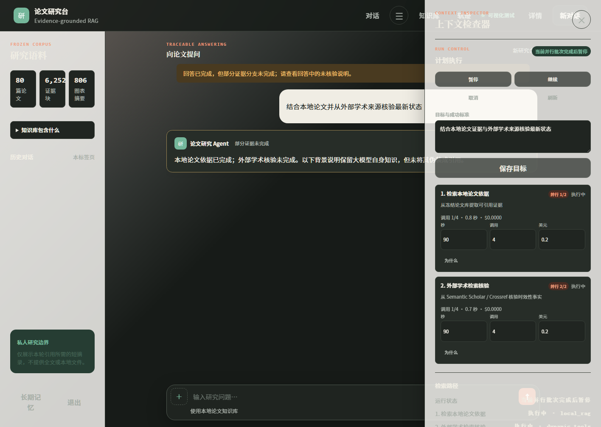
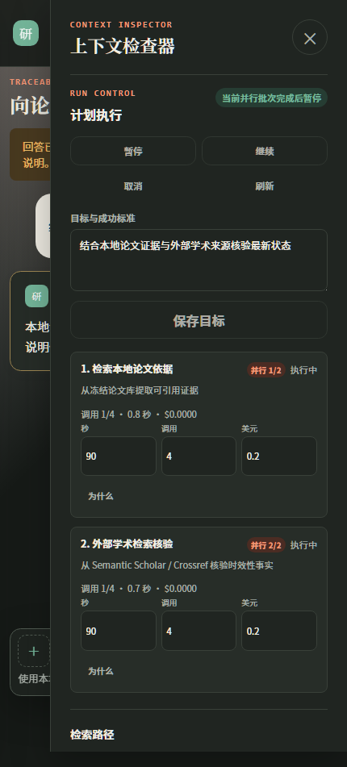

# RAG 与联网研究并行双任务验收 v1

日期：2026-09-01
范围：主 Agent 的本地论文 RAG、外部学术检索、最终大模型综合、事件与前端投影
结论：实现、离线质量门禁和浏览器视觉验收均已通过；默认保持离线和并行功能关闭，生产 live
启用仍需管理员授权并完成真实 Provider 冒烟。

## 1. 目标与非目标

目标公式为：

```text
最终回答 = 大模型自身知识与推理 + 本地 RAG 证据 + 外部学术检索证据
```

`local_rag` 与 `dynamic_tools` 是两个并行取证任务，不是互斥回答模式。大模型仍然承担问题理解、
目标规划、背景知识补充、推论和最终综合；启用任一证据分支都不等于禁用模型参数知识。

本次外部能力限定为 Semantic Scholar/Crossref 学术元数据、标识符、引用关系和论文状态检索，
不是通用网页搜索。本次也不新增第三个 `direct_chat` 并行分支，不开放任意网页浏览、Shell、代码
执行或文件系统访问。

## 2. 最终架构

```text
用户混合请求
  -> Turn Interpreter / Planner
  -> 确定性来源意图门禁
  -> ParallelTaskBatch
       ├─ local_rag       ─┐
       └─ dynamic_tools   ─┤ asyncio.TaskGroup
                            ↓
                       原子批次汇合
                            ↓
                AnswerSynthesizer + 大模型知识
                            ↓
                引用校验、降级标记、单次提交
```

Planner（规划模型）即使漏掉其中一支，策略层也会根据明确的“本地 + 外部”来源意图补齐。相同
`parallel_group_id` 的两项任务按本地、外部稳定排序，在同一 `asyncio.TaskGroup`（结构化并发）
中启动。分支只返回隔离结果，不直接修改共享 workspace；join（汇合）后统一计算任务状态、预算、
事件、降级码和来源，再原子提交一个 workspace 版本。

## 3. 关键行为验收

| 场景 | 运行状态 | 降级 | 引用与核验语义 |
|---|---|---|---|
| 本地、外部均成功 | `completed` | 否 | 本地引用保留；外部作为研究上下文；模型综合两支与自身知识 |
| 本地成功、外部失败 | `completed` | 是 | 保留本地引用；明确“外部学术核验未完成” |
| 本地失败、外部成功 | `completed` | 是 | 保留外部研究；不生成本地引用 |
| 两支失败、综合模型成功 | `completed` | 是 | 仅无引用模型背景，包含 `model_background_only` |
| 两支失败、综合模型失败 | `failed` | 不适用 | 不伪造答案或来源 |
| 并行开关关闭 | `failed` | 不适用 | 两个子执行器调用均为 0，原因 `parallel_hybrid_disabled` |

模型背景知识和推论不分配 `source_id`。本地 `[E<n>]` 只能来自本轮 `local_rag` 白名单；外部
结果继续标记为低信任 `research_context`。论文版本、维护状态等时效性事实只有本轮外部学术
分支成功时才算已核验，不能用模型参数知识或本地旧论文替代。

## 4. 权限与 Provider 就绪状态

并行外部分支采用双白名单：

- 风险白名单：仅 `network_read`。
- 名称白名单：仅 `search_scholarly_sources`、`resolve_paper_identifier`、
  `get_citation_graph`、`check_paper_status`。

任何写工具、本地读取、计算工具或其他 MCP 网络工具都在 Provider 调用前拒绝，不产生副作用，
不创建审批。风险和工具名来自冻结目录，不接受 Router 自行声明。

`CapabilityReadiness`（能力就绪状态）区分动态图是否构造、offline、live ready、请求超时和请求
失败。`PRA_SCHOLARLY_MODE=offline` 时不创建 HTTP 客户端；live Provider 的超时或失败不会被
投影为成功。

## 5. 运行控制、事件与界面

- 暂停请求在当前并行批次完成并汇合后生效；继续时不重跑已成功任务。
- 取消不在批次中间制造单边 workspace；批次汇合后取消仍开放的后续任务。
- 兄弟分支失败不会取消成功分支；只重试失败任务。
- 产品事件增加 `parallel_group_started` 与 `parallel_group_completed`，detail 只包含非敏感组 ID、
  数量、耗时和降级状态。
- 前端计划卡显示“并行 1/2”“并行 2/2”，允许两个节点同时为 running。
- 部分成功使用 warning（警告）样式，不渲染成系统错误；暂停提示为“当前并行批次完成后暂停”。

事件账本不保存问题、查询、论文正文、Provider 原始载荷、工具参数、本地路径或密钥；并发发布
仍要求 event ID 唯一、连续且幂等，终态只有一个 `done`。

### 浏览器视觉验收

使用本机 Edge 无头模式加载项目真实 `index.html + app.css + app.js`，通过浏览器调试协议注入受控
的计划 API 状态；未修改生产静态文件、未访问外部网络。宽屏和 430px 移动视口都验证到：

- 同组两张任务卡同时显示 `执行中`；
- 徽标分别为“并行 1/2”“并行 2/2”；
- 暂停请求状态显示“当前并行批次完成后暂停”；
- 降级回答显示“部分证据未完成”和 warning，而不是系统错误。





## 6. 配置与回滚

```text
PRA_MAIN_AGENT_MODE=primary
PRA_PARALLEL_HYBRID_RESEARCH_ENABLED=false
PRA_SCHOLARLY_MODE=offline
```

安全默认保持并行功能关闭、学术 Provider 离线。`PRA_PARALLEL_HYBRID_RESEARCH_ENABLED` 只接受
大小写不敏感的 `true` / `false`，`1`、`yes`、空白和非法值会令启动失败。生产启用需要同时显式
设置并行开关为 `true`、学术模式为 `live`；可选的 Semantic Scholar Key 只从本机环境读取。

回滚有两层：先关闭并行开关，使混合请求在 dispatch 前关闭失败；若主 Agent 整体出现问题，再
切换 `PRA_MAIN_AGENT_MODE=legacy`。两种回滚都不删除 SQLite、checkpoint、论文数据或已完成任务。

## 7. 评测口径

接口金标中的 `expected_model_synthesis` 表示回答链中需要有模型综合参与；单任务可能由对应 child
回答模型完成，而不额外调用主 Agent 的最终综合模型。混合研究不只依赖该通用字段：真实主图
端到端测试还单独断言 `AnswerSynthesizer` 的最终综合模型恰好调用一次，并保留测试模型注入、
child artifact 中不存在的通用背景说明。这一约束证明大模型自身知识没有被两个检索分支替代。

## 8. 测试证据

实施过程中已通过以下定向门禁：

- 权限、记忆与 Bootstrap：46 项。
- 主图、批次与事件：44 项及 5 个子测试。
- 严格回滚开关：45 项及 10 个子测试。
- 前端、API 与 Runtime：59 项。
- Provider readiness：37 项及 5 个子测试。
- 金标评测：8 项。
- 真实主图端到端与评测：16 项及 5 个子测试。
- 20 轮并行性能：6 项。
- workspace 提交版本与 Runtime 返回版本一致性：18 项。

最终门禁结果：

- `pytest`：999 项通过、171 个子测试通过、2 条既有依赖警告，耗时 71.75 秒。
- Ruff：全部通过。
- mypy：165 个源文件零问题。
- `git diff --check`：通过。
- 宽屏和 430px 移动视口视觉验收：通过。
- 工作树敏感内容审计：未发现真实 Key、数据库、论文、索引或 Provider 原始响应；用户原有
  `AGENTS.md` 修改保持未触碰。

完整回归初次暴露一条旧双语检索测试的 20ms 调度抖动；已将它改为六方异步屏障，在不降低“6
个不同查询并发、同查询 one-flight（单航班去重）”期望的前提下消除时序偶发性，随后完整套件
全绿。

当前保持 `PRA_SCHOLARLY_MODE=offline` 且没有本轮真实联网授权，因此 live Provider 冒烟未执行；
这不是失败伪装为通过，而是明确的生产启用前条件。
